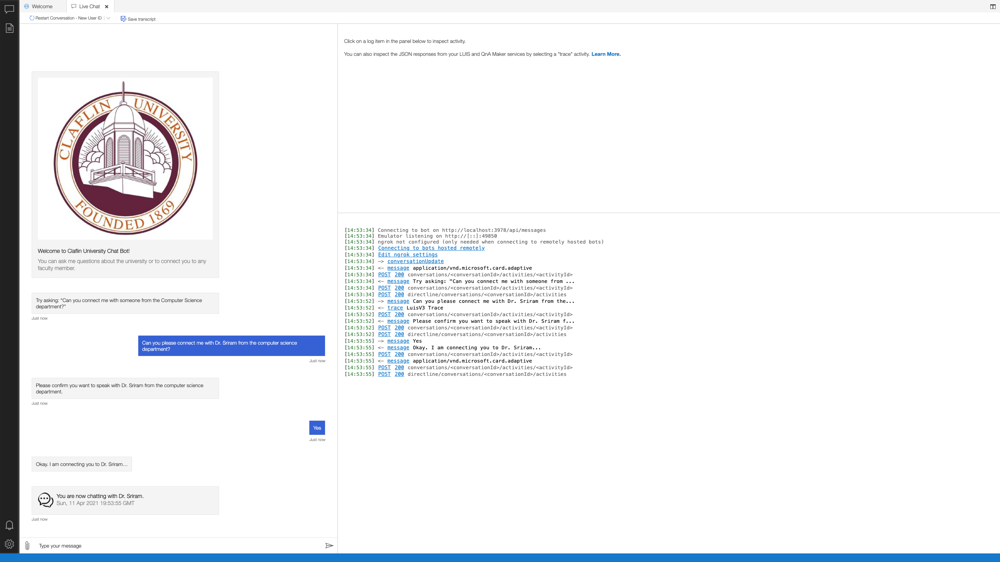
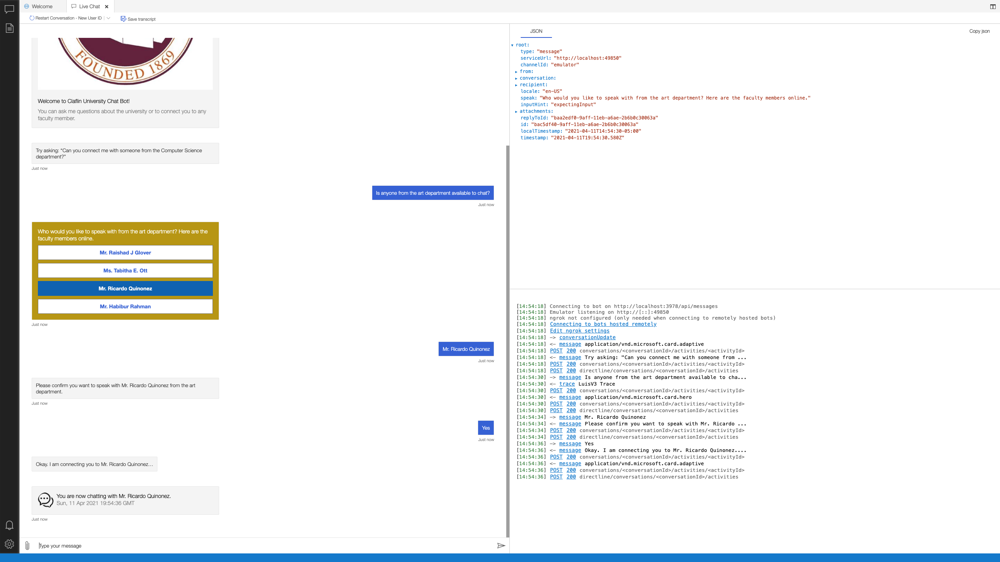
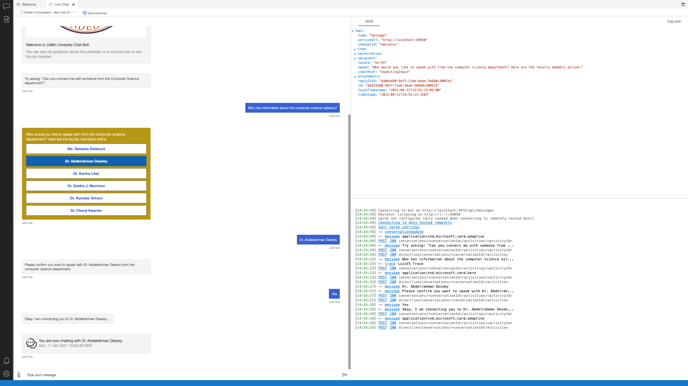

# Claflin University Chatbot

- Connects Claflin University students to any university faculty
- Stores faculty information as JSON within codebase
- Uses [LUIS](https://www.luis.ai) to implement core AI capabilities
- Implements a multi-turn conversation using Dialogs
- Prompts for and validate requests for information from the user

## Overview

This bot uses [LUIS](https://www.luis.ai), an AI based cognitive service, to implement language understanding.

- [Node.js](https://nodejs.org) version 10.14 or higher

    ```bash
    # determine node version
    node --version
    ```

## Run this bot locally

- Clone the repository

    ```bash
    git clone https://github.com/ndubuisx/claflin_chatbot.git
    ```

- In a terminal, navigate to `claflin_chatbot`

    ```bash
    cd claflin_chatbot
    ```

- Install modules

    ```bash
    npm install
    ```

- Setup LUIS

    The prerequisites outlined above contain the steps necessary to provision a language understanding model on www.luis.ai.  Refer to _Create a LUIS Application to enable language understanding_ above for directions to setup and configure LUIS.

- Run the sample

    ```bash
    npm start
    ```

## Testing the bot using Bot Framework Emulator

[Bot Framework Emulator](https://github.com/microsoft/botframework-emulator) is a desktop application that allows bot developers to test and debug their bots on localhost or running remotely through a tunnel.

- Install the latest Bot Framework Emulator from [here](https://github.com/Microsoft/BotFramework-Emulator/releases)

## Connect to the bot using Bot Framework Emulator

- Launch Bot Framework Emulator
- File -> Open Bot
- Enter a Bot URL of `http://localhost:3978/api/messages`

## Demo
Using state-of-the-art natural language capabilities, the chat bot is able to understand when users want to speak with someone from any department regardless of how they phrase their queries.






